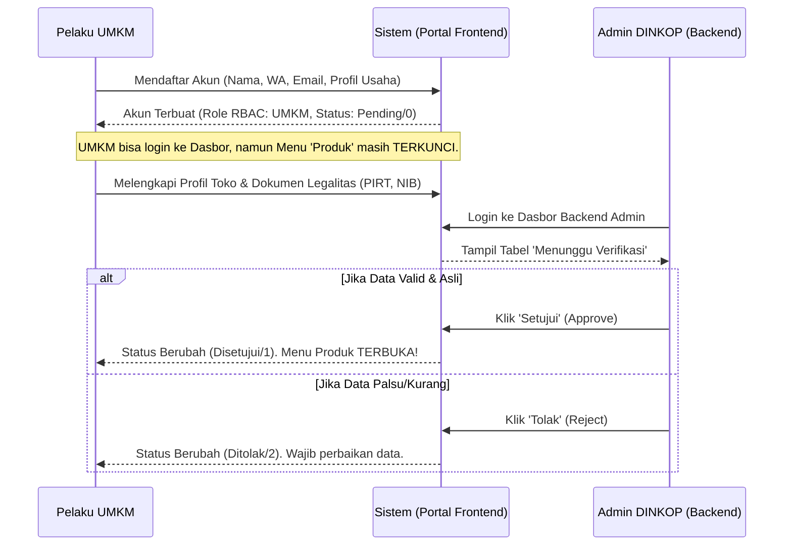
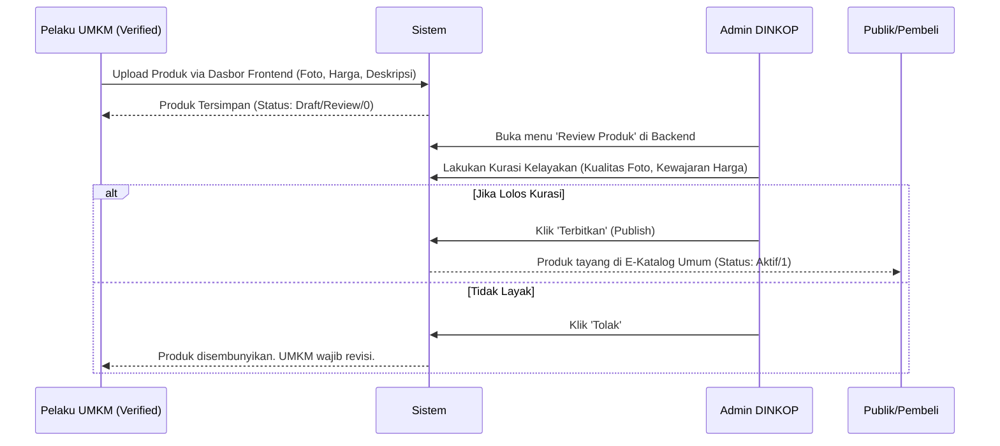
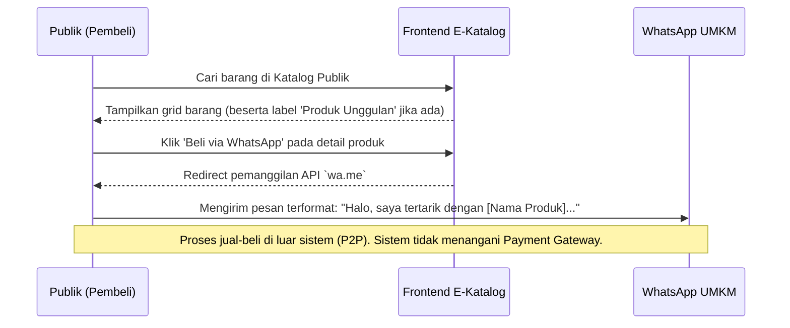

<p align="center">
    
    <h1 align="center">E-Katalog UMKM Dinkop Semarang</h1>
    <p align="center"><strong>Platform Resmi Pemberdayaan Produk Usaha Mikro Kota Semarang</strong></p>
</p>

---

## 📖 Ringkasan Aplikasi
**E-Katalog UMKM SemarPreneurUP** adalah aplikasi berbasis web berskala *enterprise* yang dirancang untuk mendigitalkan, mengkurasi, dan mempromosikan produk/jasa dari pelaku Usaha Mikro, Kecil, dan Menengah (UMKM) di bawah naungan Dinas Koperasi (DINKOP) Kota Semarang.

Aplikasi ini menggunakan kerangka kerja (framework) **Yii2 Advanced** dengan arsitektur multi-tier yang memisahkan aplikasi menjadi dua bagian utama:
1. **Frontend (Portal Publik & Dasbor UMKM)**
2. **Backend (Dasbor Kurasi & Manajemen DINKOP)**

---

## 🛠️ Stack Teknologi
- **Bahasa Pemrograman**: PHP 7.4.x
- **Framework**: Yii2 Advanced Application Template
- **Database**: MySQL / MariaDB (`semarang_umkm`)
- **Frontend & UI/UX**: Bootstrap 5, FontAwesome 6, Alpine.js (untuk interaktivitas ringan)
- **Web Server**: Apache/Nginx

---

## 🔄 Alur Bisnis & Cara Kerja (Workflow)

Dengan melihat diagram di bawah ini, pengembang (programmer) dapat langsung memahami *business logic* lintas aktor (Admin, Pelaku UMKM, dan Publik).

### 1. Pendaftaran & Verifikasi UMKM (Onboarding)


### 2. Kurasi & Publikasi Produk


### 3. Etalase Publik & Transaksi (P2P via WhatsApp)


---

## 🗄️ Kamus Basis Data (Data Dictionary)

Berikut adalah struktur tabel dan **arti sandi angka (status)** yang berlaku mutlak di dalam _database_ `semarang_umkm` agar *programmer* tidak tersesat saat melakukan *query* SQL murni:

### A. Tabel `user` (Autentikasi Inti)
| Kolom | Tipe Data | Deskripsi & Kamus Nilai |
|---|---|---|
| `id` | INT | Primary Key |
| `username` | VARCHAR | Nama masuk |
| `password_hash`| VARCHAR | Bcrypt hash |
| `status` | SMALLINT | `10` = Aktif | `9` = Nonaktif (Unverified Email) | `0` = Banned/Dihapus |

### B. Tabel `umkm_profile` (Identitas Toko)
Terhubung dengan FK ke `user.id`. 
| Kolom | Tipe Data | Deskripsi & Kamus Nilai |
|---|---|---|
| `nama_usaha` | VARCHAR | Merk dagang usaha |
| `no_whatsapp` | VARCHAR | Narahubung transaksi pembeli |
| `omzet_usaha` | DECIMAL | Keuangan per bulan dalam Rupiah |
| `status_verifikasi`| TINYINT | **Inti Akses UMKM:** <br>`0` = **Pending** (Akses Dasbor Dibatasi) <br>`1` = **Disetujui** (Fitur Produk Terbuka) <br>`2` = **Ditolak** (Akun dibekukan) |

### C. Tabel `products` (Entitas Etalase)
| Kolom | Tipe Data | Deskripsi & Kamus Nilai |
|---|---|---|
| `umkm_profile_id`| INT | Mengikat ke profil pemilik `umkm_profile.id` |
| `is_featured` | TINYINT | `1` = Promosi Khusus (Unggulan) | `0` = Reguler |
| `status` | TINYINT | **Status Tayang:** <br>`0` = **Draft/Review** (Hanya UMKM & Admin yang lihat) <br>`1` = **Publik/Active** (Tayang di Katalog Kota) <br>`2` = **Rejected** (Gagal kurasi) |

### D. Tabel Lainnya
- `categories`: _Master Data_ tipe produk (barang fisik/jasa) yang hanya diatur oleh Admin Backend.
- `product_image`: Menampung mult-gambar, dengan kolom `is_primary` = `1` untuk sampul depan produk.
- `umkm_legalitas`: Penyimpanan _path file_ pendukung hukum usaha seperti NIB, Halal, PIRT, dll.
- `auth_assignment`: Menyimpan data RBAC (Role-Based Access Control). Peran yang ada: `admin_dinkop` dan `umkm`.

---

## 💻 Panduan Instalasi & Setup Lokal

Ikuti langkah instalasi ini agar aplikasi dapat berjalan mulus di mesin *developer* baru:

1. **Persiapan Dependensi**
   Pastikan Anda menggunakan PHP 7.4 dan telah menginstal *Composer*.
   ```bash
   git clone https://github.com/erinurshofa/e-catalog-dinkop.git
   cd e-catalog-dinkop
   composer install
   ```
2. **Inisialisasi Lingkungan (Environment)**
   Jalankan perintah ini di root folder dan pilih `0` untuk mode *Development*.
   ```bash
   php init
   ```
3. **Konfigurasi Database**
   Buka file `common/config/main-local.php`, dan ubah parameter koneksi PDO Anda:
   ```php
   'dsn' => 'mysql:host=localhost;dbname=semarang_umkm',
   'username' => 'root',
   'password' => '',
   ```
4. **Migrasi Database & Seeding**
   Di dalam direktori utama, jalankan perintah migrasi ini karena sistem telah tersertai *migration script* yang lengkap.
   ```bash
   php yii migrate
   ```
   *Catatan:* Jika _database_ kosong, gunakan Seeder/Dummy Controller yang tersedia untuk membangkitkan data awal (`php yii dummy-data`).

5. **Pengaturan URL / Akses Server Localhost**
   Arahkan _web server_ Anda (Apache/Nginx/XAMPP) masing-masing ke:
   - **Frontend (Katalog Publik & Dasbor UMKM):** `http://localhost/e-catalog-dinkop/frontend/web/`
   - **Backend (Dasbor Admin DINKOP):** `http://localhost/e-catalog-dinkop/backend/web/`

---

## 🔐 Akun Default Admin
Untuk keperluan pengembangan, Anda dapat langsung masuk ke _Backend_ menggunakan skema default:
- **Username**: `admin`
- **Password**: `password123` *(Atau tergantung seeder Yii2 awal)*

---
*Dikembangkan dengan penuh dedikasi untuk pemberdayaan UMKM Kota Semarang.*
