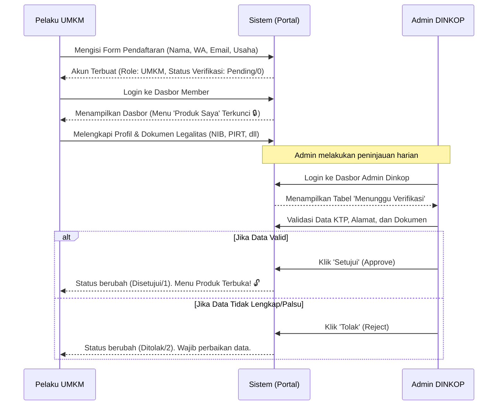
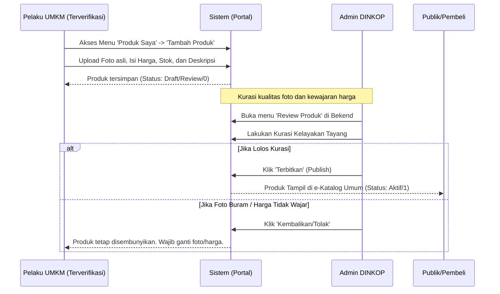
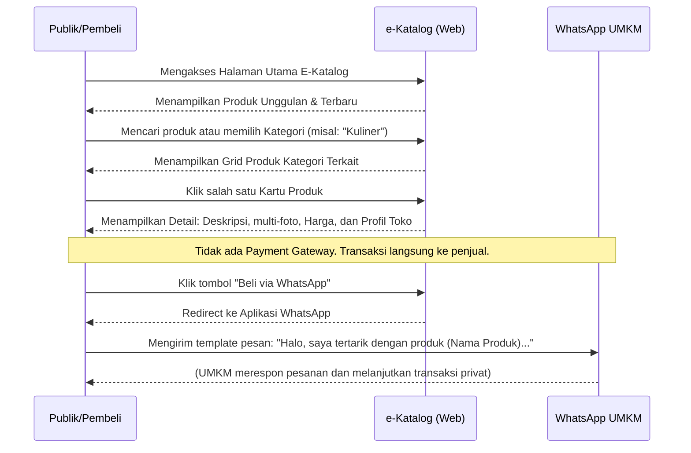

# 🔄 Alur Sistem e-Katalog UMKM Dinkop Semarang

Dokumen ini menjelaskan alur kerja (*Business Flow*) utama dari aplikasi katalog dari sisi Pelaku UMKM, Admin DINKOP, dan Masyarakat Umum.

---

## 1. Alur Pendaftaran & Verifikasi UMKM (Onboarding)
Flow ini menjelaskan bagaimana seorang pelaku usaha mendaftar hingga akunnya disetujui.

---

## 2. Alur Unggah & Publikasi Produk
Flow ini menjelaskan tata cara UMKM menawarkan barang dagangannya hingga bisa dibeli masyarakat.

---

## 3. Alur Etalase & Transaksi Masyarakat (Katalog Publik)
Flow ini mendeskripsikan aktivitas pengunjung secara umum saat mencari barang.

---

### Hak Akses / Otorisasi Berjenjang
1. **DINKOP (Admin)**: 
   - Memiliki kendali penuh menyetujui (`approve`) pengguna dan produk. 
   - Bisa mengatur *Master* Kategori Produk.
   - Bisa menyorot (*Featured*) produk-produk terbaik untuk diletakkan di halaman depan.
2. **UMKM (Member)**:
   - Terkunci haknya hingga diverifikasi Admin.
   - Setelah valid, bisa mengelola Etalase internal tokonya sendiri (CRUD Produk).
3. **Masyarakat Umum (Guest)**:
   - Hanya memiliki hak akses membacakatalog produk (Beranda, Daftar Kategori, Pencarian).
   - Diarahkan bertransaksi P2P (*Peer-to-Peer*) melalui sambungan WhatsApp.
